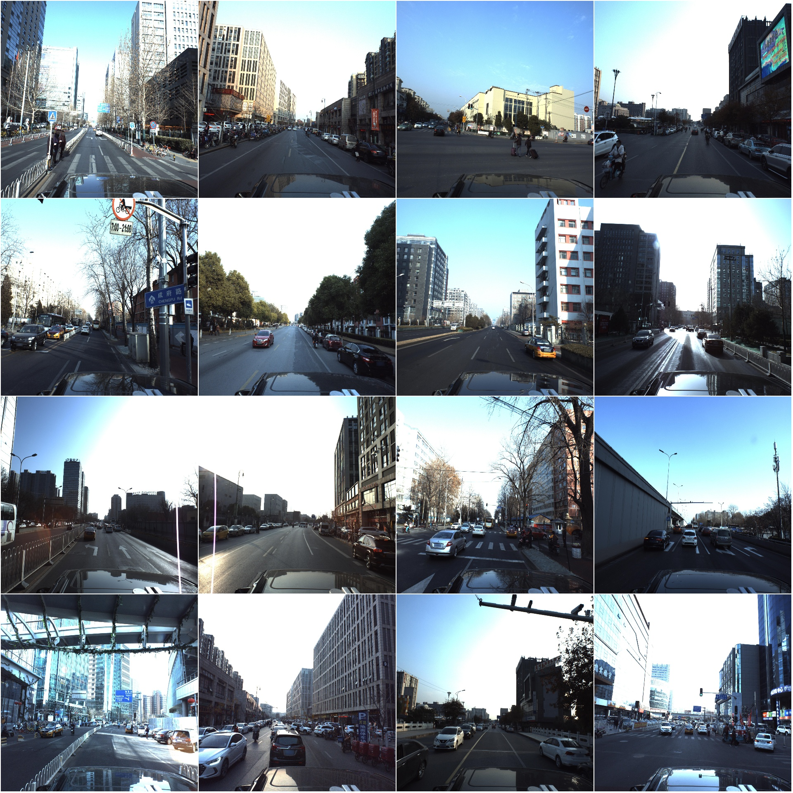
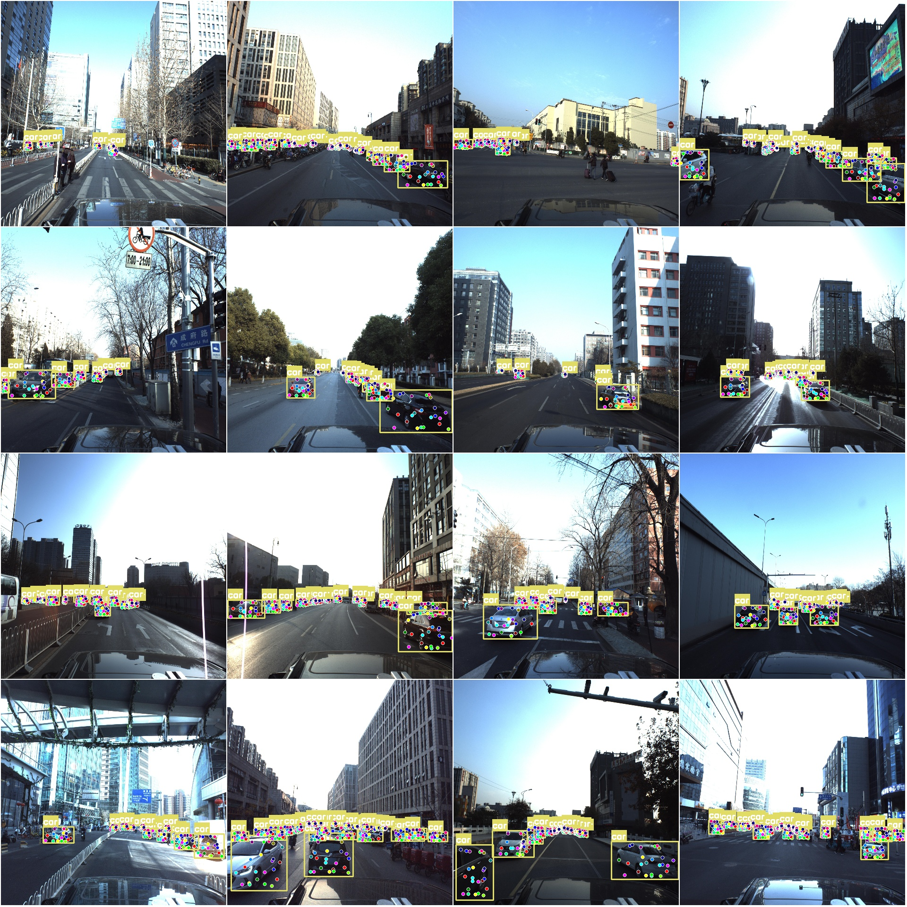

# Vehicle Keypoint Detection Dataset COCO+YOLO Format: 4283 Images in 1 Class with 24 Keypoints

Dataset Format: YOLO keypoint format (Note this is not the target detection or segmentation YOLO format, only contains jpg images and corresponding yolo format txt files).
Image Count (Number of jpg files): 4283
Annotation Count (Number of txt files): 4283
Training Set Count: 3426
Validation Set Count: 429
Test Set Count: 428
Number of Annotation Categories: 1
Annotation Category Name: ['car']
Number of Keypoints to Mark: 24
Keypoint Names:
- front_up_right
- front_up_left
- front_light_right
- front_light_left
- front_low_right
- front_low_left
- central_up_left
- front_wheel_left
- rear_wheel_left
- rear_corner_left
- rear_up_left
- rear_up_right
- rear_light_left
- rear_light_right
- rear_low_left
- rear_low_right
- central_up_right
- rear_corner_right
- rear_wheel_right
- front_wheel_right
- rear_plate_left
- rear_plate_right
- mirror_edge_left
- mirror_edge_right

Number of Boxes per Class: car box count = 70383
Total Boxes: car box count = 70383
Image Resolution: 3384x2710
Important Notice: The dataset has been divided into training, validation, and test sets, which can be directly used for training models like YOLOv5-pose, YOLOv8-pose, YOLOv11-pose, or YOLOv26-pose.
Special Notice: This dataset does not guarantee the accuracy of the trained model or the weight file.
Image Preview:
Annotation Example:
Randomly selected 16 images:
Annotation drawing result:

## Images

Here is a pay link on Stripe ( https://buy.stripe.com/3cs8yP7sY87d0vu9AB ). Please contact me lonlonago@foxmail.com after funding $89, and I will send you a complete data files , thank you!

